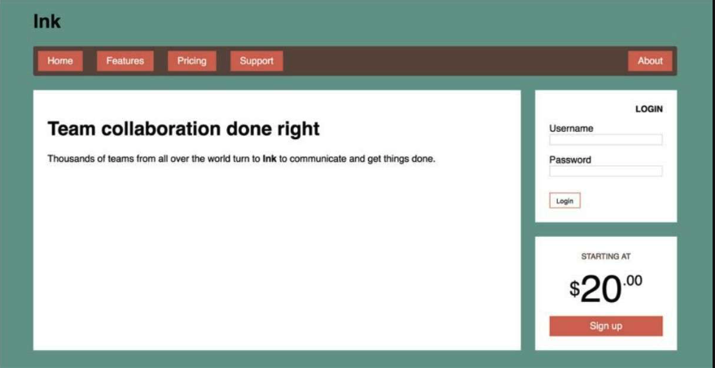
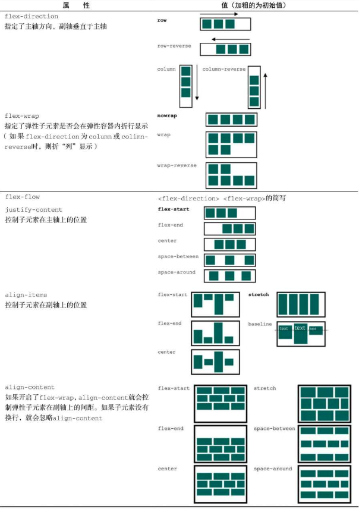
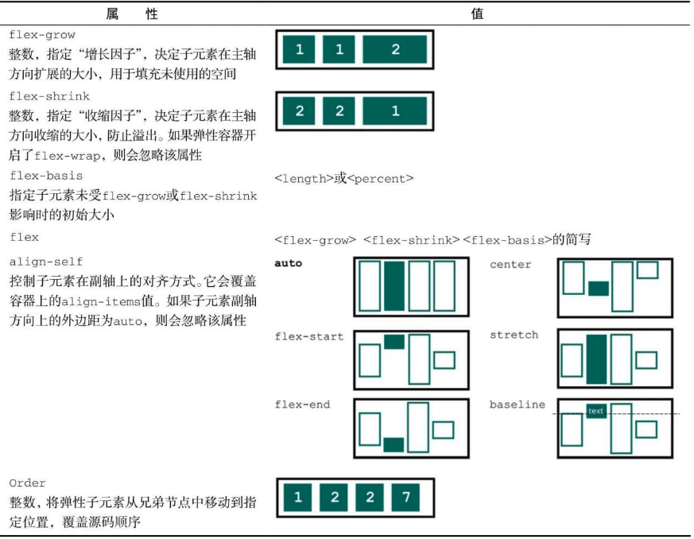
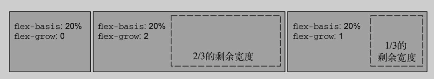
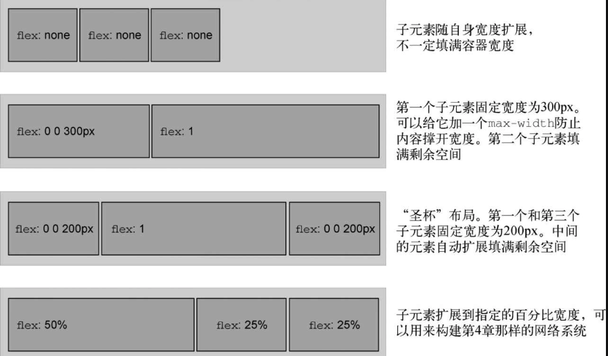

# `Flexbox`的原则

给元素添加`display:flex`，该元素变成了一个*弹性容器*，它的直接子元素变成了*弹性子元素*。

弹性子元素默认是在同一行按照从左到右的顺序并排排列。**弹性子元素高度相等**（这也是`Flexbox`可以轻易实现等高布局的原因），该高度由它们的内容决定。

弹性容器像块元素一样填满可用宽度，但是弹性子元素不一定填满其弹性容器的宽度。


# 案例一



代码准备：

```html
<!DOCTYPE html>
<html lang="en">
  <head>
    <title>Home</title>
    <meta charset="UTF-8" />
    <meta name="viewport" content="width=device-width" />
    <style>
      :root {
        box-sizing: border-box;
      }
      *,
      ::before,
      ::after {
        box-sizing: inherit;
      }

      body {
        background: #eee;
      }

      body * + * {
        margin-top: 1.5em;
      }
      .container {
        max-width: 1080px;
        margin: 0 auto;
      }
    </style>
  </head>
  <body>
    <div class="container">
      <header>
        <h1>Ink</h1>
      </header>
      <nav>
        <ul class="site-nav">
          <li><a href="">Home</a></li>
          <li><a href="">Features</a></li>
          <li><a href="">Pricing</a></li>
          <li><a href="">Support</a></li>
          <li class="nav-right"><a href="">About</a></li>
        </ul>
      </nav>
      <main class="flex">
        <div class="column-main title">
          <h1>Team collaboration done right</h1>
          <p>
            Team collaboration done right,Team collaboration done right,Team
            collaboration done right,Team collaboration done right.
          </p>
        </div>

        <div class="column-sidebar">
          <div class="title">
            <form class="login-form" action="">
              <h3>login</h3>
              <p>
                <label for="username">Username</label>
                <input id="username" type="text" name="username" />
              </p>
              <p>
                <label for="password">Password</label>
                <input id="password" type="password" name="password" />
              </p>
              <button type="submit">Login</button>
            </form>
          </div>
          <div class="title centered">
            <small>starting at</small>
            <div class="cost">
              <span class="cost-currency">$</span>
              <span class="cost-dollars">20</span>
              <span class="cost-cents">.00</span>
            </div>
            <a class="cta-button" href="">Sign up</a>
          </div>
        </div>
      </main>
    </div>
  </body>
</html>

```

首先完成导航栏的样式：

```css
      .site-nav {
        display: flex;
        list-style-type: none;
        background-color: #5f4b44;
        padding-left: 0;
        padding: 0.5em;
      }
      .site-nav > li {
        margin-top: 0;
      }

      .site-nav > li > a {
        background-color: #cc6b5a;
        color: white;
        text-decoration: none;
        padding: 0.5em 1em;
        display: block; /*撑开父元素高度 */
      }
      .site-nav > li + li {
        margin-left: 1.5em;
      }
      .site-nav > .nav-right {
        margin-left: auto;
      }
```

注意这里的链接被设置为块级元素。如果链接还是行内元素，那么它给父元素贡献的高度会根据行高计算，而不是根据内边距和内容，这样不符合预期。另外，这里给水平方向设置的内边距比垂直方向的要多一点，因为从美学上来讲这样更让人愉悦。

`Flexbox`允许使用`margin: auto`来填充弹性子元素之间的可用空间。如此可以让最后一个元素靠右。

---

接下来实现主体部分：

简写声明`flex: 2`和`flex: 1`设置了一个弹性基准值为0%，因此容器宽度的100%都是剩余宽度（减去两列之间`1.5em`的外边距）。剩余宽度会分配给两列：第一列得到2/3的宽度，第二列得到1/3的宽度

```css
      .title {
        padding: 1.5em;
        background-color: white;
      }
      .flex {
        display: flex;
      }
      .flex > * + * {
        margin-top: 0;
        margin-left: 1.5em;
      }
      .column-main {
        flex: 2;
      }
      .column-sidebar {
        flex: 1;
      }
```


---

接下来实现等高布局。上述代码已经完成基本的样式布局，但是给`column-main`添加几个标题和段落，会发现`column-sidebar`内容并没有跟随增大。

```css
      .column-sidebar {
        flex: 1;
        display: flex;
        flex-direction: column;
      }
      .column-sidebar .title {
        flex: 1;
      }
```

真正需求是让两列扩展到填满容器的高度。因此要将右边栏（`column-sidebar`）改为弹性容器，并设置`flex-direction: column`。然后给里面的两个板块设置非0的`flex-grow`值。

`flex-direction`可以切换主轴的方向，相应的`flex-basis`、`flex-grow`和`flex-shrink`也会跟随作用于主轴的方向。

---

接下来实现登录表单的样式。

```css

      .login-form h3 {
        margin: 0;
        font-size: 0.9em;
        font-weight: bold;
        text-align: end;
        text-transform: uppercase;
      }
      .login-form input:not([type='checkbox']):not([type='radio']) {
        display: block;
        width: 100;
        margin-top: 0;
      }
      .login-form button {
        margin-top: 1em;
        border: 1px solid #cb665a;
        background-color: white;
        padding: 0.5em 1em;
        cursor: pointer;
      }
```

给输入框设置了`display: block`，让它们单独占据一行，还要将其宽度设置为100%。通常情况下，块级元素会自动填满可用宽度，但是`<input>`比较特殊，其宽度由`size`属性决定，而它表示不出滚动条的情况下大致能容纳的字符数量。如果不指定的话，该属性就会恢复为默认值。可以用`CSS`的`width`属性强制指定宽度。

---

接下来完成板块的最后一部分：

```css
      .centered {
        text-align: center;
      }
      .cost {
        display: flex;
        justify-content: center;
        align-items: center;
        line-height: 0.7;
      }

      .cost > span {
        margin-top: 0;
      }
      .cost-currency {
        font-size: 2rem;
      }
      .cost-dollars {
        font-size: 4rem;
      }
      .cost-cents {
        font-size: 1.5rem;
        align-self: flex-start;
      }
      .cta-button {
        display: block;
        background: #cc6b5a;
        color: white;
        padding: 0.5em 1em;
        text-decoration: none;
      }
```

---

完整代码：

```html
<!DOCTYPE html>
<html lang="en">
  <head>
    <title>Home</title>
    <meta charset="UTF-8" />
    <meta name="viewport" content="width=device-width" />
    <style>
      :root {
        box-sizing: border-box;
      }
      *,
      ::before,
      ::after {
        box-sizing: inherit;
      }

      body {
        background: #eee;
      }

      body * + * {
        margin-top: 1.5em;
      }
      .container {
        max-width: 1080px;
        margin: 0 auto;
      }
      .site-nav {
        display: flex;
        list-style-type: none;
        background-color: #5f4b44;
        padding-left: 0;
        padding: 0.5em;
      }
      .site-nav > li {
        margin-top: 0;
      }

      .site-nav > li > a {
        background-color: #cc6b5a;
        color: white;
        text-decoration: none;
        padding: 0.5em 1em;
        display: block; /*撑开父元素高度 */
      }
      .site-nav > li + li {
        margin-left: 1.5em;
      }
      .site-nav > .nav-right {
        margin-left: auto;
      }

      .title {
        padding: 1.5em;
        background-color: white;
      }
      .flex {
        display: flex;
      }
      .flex > * + * {
        margin-top: 0;
        margin-left: 1.5em;
      }
      .column-main {
        flex: 2;
      }
      .column-sidebar {
        flex: 1;
        display: flex;
        flex-direction: column;
      }
      .column-sidebar .title {
        flex: 1;
      }

      .login-form h3 {
        margin: 0;
        font-size: 0.9em;
        font-weight: bold;
        text-align: end;
        text-transform: uppercase;
      }
      .login-form input:not([type='checkbox']):not([type='radio']) {
        display: block;
        width: 100;
        margin-top: 0;
      }
      .login-form button {
        margin-top: 1em;
        border: 1px solid #cb665a;
        background-color: white;
        padding: 0.5em 1em;
        cursor: pointer;
      }

      .centered {
        text-align: center;
      }
      .cost {
        display: flex;
        justify-content: center;
        align-items: center;
        line-height: 0.7;
      }

      .cost > span {
        margin-top: 0;
      }
      .cost-currency {
        font-size: 2rem;
      }
      .cost-dollars {
        font-size: 4rem;
      }
      .cost-cents {
        font-size: 1.5rem;
        align-self: flex-start;
      }
      .cta-button {
        display: block;
        background: #cc6b5a;
        color: white;
        padding: 0.5em 1em;
        text-decoration: none;
      }
    </style>
  </head>
  <body>
    <div class="container">
      <header>
        <h1>Ink</h1>
      </header>
      <nav>
        <ul class="site-nav">
          <li><a href="">Home</a></li>
          <li><a href="">Features</a></li>
          <li><a href="">Pricing</a></li>
          <li><a href="">Support</a></li>
          <li class="nav-right"><a href="">About</a></li>
        </ul>
      </nav>
      <main class="flex">
        <div class="column-main title">
          <h1>Team collaboration done right</h1>
          <p>
            Team collaboration done right,Team collaboration done right,Team
            collaboration done right,Team collaboration done right.
          </p>
          <h1>Team collaboration done right</h1>
          <p>
            Team collaboration done right,Team collaboration done right,Team
            collaboration done right,Team collaboration done right.
          </p>
          <h1>Team collaboration done right</h1>
          <p>
            Team collaboration done right,Team collaboration done right,Team
            collaboration done right,Team collaboration done right.
          </p>
        </div>

        <div class="column-sidebar">
          <div class="title">
            <form class="login-form" action="">
              <h3>login</h3>
              <p>
                <label for="username">Username</label>
                <input id="username" type="text" name="username" />
              </p>
              <p>
                <label for="password">Password</label>
                <input id="password" type="password" name="password" />
              </p>
              <button type="submit">Login</button>
            </form>
          </div>
          <div class="title centered">
            <small>starting at</small>
            <div class="cost">
              <span class="cost-currency">$</span>
              <span class="cost-dollars">20</span>
              <span class="cost-cents">.00</span>
            </div>
            <a class="cta-button" href="">Sign up</a>
          </div>
        </div>
      </main>
    </div>
  </body>
</html>

```

案例一知识点：

1. 子组合器（`>`）被放在两个 `CSS` 选择器之间。它只匹配那些被第二个选择器匹配的元素，这些元素是被第一个选择器匹配的元素的直接子元素。


# 弹性容器的属性：


## `flex-wrap`属性

启用换行后，子元素不再根据`flex-shrink`值收缩，任何超过弹性容器的子元素都会换行显示。

如果弹性方向是`column`或`column-reverse`，那么`flex-wrap`会允许弹性子元素换到新的一列显示，不过这只在限制了容器高度的情况下才会发生，否则容器会扩展高度以包含全部弹性子元素。

## `flex-flow`属性

`flex-flow`属性是`flex-direction`和`flex-wrap`的简写。例如，`flex-flow:column wrap`指定弹性子元素按照从上到下的方式排列，必要时换到新的一列。

## `justify-content`属性

当子元素未填满容器时，`justify-content`属性控制子元素沿主轴方向的间距。

间距是在元素的外边距之后进行计算的，而且`flex-grow`的值要考虑进来。也就是说，如果任意子元素的`flex-grow`的值不为0，或者任意子元素在主轴方向的外边距值为`auto`,` justify-content`就失效了。

## `align-items`属性

控制子元素在副轴方向的对齐方式。

## `align-content`属性

如果开启了换行（用`flex-wrap`）,`align-content`属性就可以控制弹性容器内沿副轴方向每行之间的间距。它支持的值有`flex-start`、`flex-end`、`center`、`stretch`（初始值）、`space-between`以及`space-around`。这些值对间距的处理类似上面的`justify-content`。

# 弹性子元素的属性：




## `flex`

`flex`属性是三个不同大小属性的简写：`flex-grow`、`flex-shrink`和`flex-basis`。

`flex-basis`：定义了元素大小的基准值，即一个初始的“主尺寸”。`flex-basis`属性可以设置为任意的`width`值，包括`px`、`em`、百分比。它的初始值是`auto`，此时浏览器会检查元素是否设置了`width`属性值。如果有，则使用`width`的值作为`flex-basis`的值；如果没有，则用元素内容自身的大小。如果`flex-basis`的值不是`auto`, `width`属性会被忽略。

`flex-grow`：每个弹性子元素的`flex-basis`值计算出来后，它们（加上子元素之间的外边距）加起来会占据一定的宽度。加起来的宽度不一定正好填满弹性容器的宽度，可能会有留白。多出来的留白（或剩余宽度）会按照`flex-grow`（增长因子）的值分配给每个弹性子元素，`flex-grow`的值为非负整数。如果一个弹性子元素的`flex-grow`值为0，那么它的宽度不会超过`flex-basis`的值；如果某个弹性子元素的增长因子非0，那么这些元素会增长到所有的剩余空间被分配完，也就意味着弹性子元素会填满容器的宽度。`flex-grow`的值越大，元素的“权重”越高，也就会占据更大的剩余宽度。一个`flex-grow:2`的子元素增长的宽度为`flex-grow: 1`的子元素的两倍。
	   
	   
`flex-shrink`属性与`flex-grow`遵循相似的原则。计算出弹性子元素的初始主尺寸后，它们的累加值可能会超出弹性容器的可用宽度。如果不用`flex-shrink`，就会导致溢出。`flex-shrink`属性与`flex-grow`遵循相似的原则。计算出弹性子元素的初始主尺寸后，它们的累加值可能会超出弹性容器的可用宽度。如果不用`flex-shrink`，就会导致溢出。

### 实际应用



## `align-self`属性

该属性控制弹性子元素沿着容器副轴方向的对齐方式。它跟弹性容器的`align-items`属性效果相同，但是它能单独给弹性子元素设定不同的对齐方式。`auto`为初始值，会以容器的`align-items`值为准。其他值会覆盖容器的设置。

## `order`属性

初始状态下，所有的弹性子元素的`order`都为0。指定一个元素的值为−1，它会移动到列表的最前面；指定为1，则会移动到最后。可以按照需要给每个子元素指定`order`以便重新编排它们。这些值不一定要连续。

