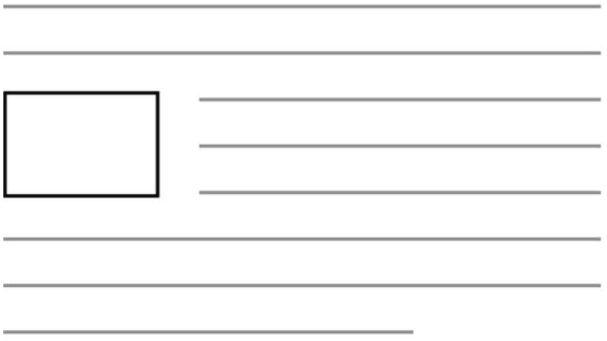
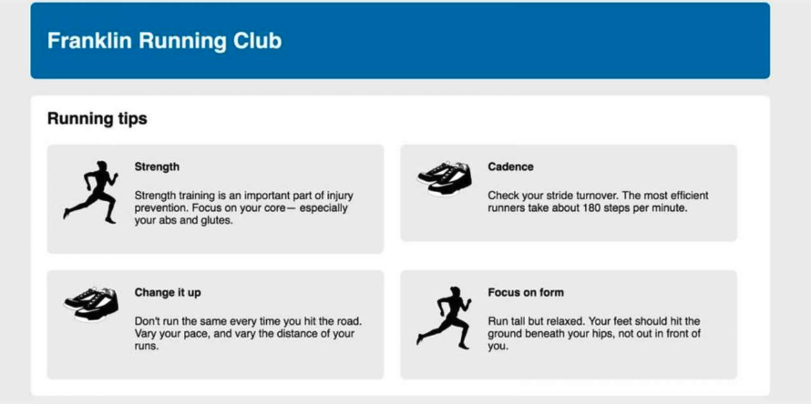
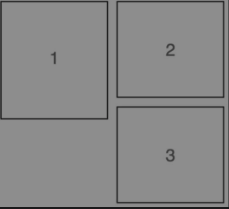

# 设计初衷
为了实现报纸上很常见的场景：



浮动元素会被移出正常文档流，并被拉到容器边缘。文档流会重新排列，**但是它会包围浮动元素此刻所占据的空间**。如果让多个元素向同侧浮动，它们就会挨着排列

# 案例一

实现如下布局：


基础代码：

```html
<!DOCTYPE html>
<html lang="en">
  <head>
    <title>Home</title>
    <meta charset="UTF-8" />
    <meta name="viewport" content="width=device-width" />
    <style>
      :root {
        box-sizing: border-box;
      }
      *,
      ::before,
      ::after {
        box-sizing: inherit;
      }

      body {
        background: #eee;
      }

      body * + * {
        margin-top: 1.5em;
      }

      header {
        padding: 1em 1.5em;
        color: #fff;
        background: #0072ba;
        border-radius: 0.5em;
      }
      .main {
        padding: 0 1.5em;
        background: #fff;
        border-radius: 0.5em;
      }

      .media-image {
        width: 80px;
        height: 80px;
      }
    </style>
  </head>
  <body>
    <div class="container">
      <header>
        <h1>Franklin Running club</h1>
      </header>
      <main class="main clearfix">
        <h2>Running tips</h2>

        <div>
          <div class="media">
            
            <div class="media-body">
              <h4>Strength</h4>
              <p>
                Strength training is an important part ofinjury prevention.
                focus on your coresmdashr especially vour abs and glutes .
              </p>
            </div>
          </div>

          <div class="media">
            
            <div class="media-body">
              <h4>Cadences</h4>
              <p>
                Check your stkide turnover. The most efficient runners take
                about 180 steps per minute.
              </p>
            </div>
          </div>

          <div class="media">
            
            <div class="media-body">
              <h4>Change it up</h4>
              <p>
                Don't run the same everv time you hit theroad. Vary your pace,
                and vary the distance of your runs .
              </p>
            </div>
          </div>

          <div class="media">
            
            <div class="media-body">
              <h4>Fpocus on form</h4>
              <p>
                Run tall but relaxed. Your feet should hit the ground beneath
                your hips, not out in front of you .
              </p>
            </div>
          </div>
        </div>
      </main>
    </div>
  </body>
</html>

```

---
接下来实现**双容器模式**布局：通过将内容放置到两个嵌套的容器中，然后给内层的容器设置外边距，让它在外层容器中居中。

在本例中，`<body>`就是外层容器。因为它默认是100%的网页宽度，所以不用给它添加新的样式。在`<body>`内部，整个网页的内容放在了`<div class="container">`，也就是内层容器中。对于内层容器，需要设置一个`max-width`，并将外边距设置为`auto`，使内容居中。

```css
      .container {
        max-width: 1080px;
        margin: 0 auto;
      }
```

---

接下来让四个卡片浮动：

```css
      .media {
        float: left;
        width: 50%;
        padding: 1.5em;
        background: #eee;
        border-radius: 0.5em;
      }
```

此时会发现浮动元素常见的问题：浮动元素的高度不会计算进父元素上（虽然我们经常称之为问题但是这恰巧体现了设计的初衷：浮动是为了实现文字围绕浮动元素排列的效果。在段落里浮动图片时，段落的高度并不会增长到能够容纳该图片。也就是说，如果图片比段落文字高，下一段会直接从上一段的文字下面开始，两段文字都会围绕浮动的图片排列）。

一个解决方案是我们常说的外墙法或者内墙法：将一个元素放在主容器的末尾，并对它使用`clear`，这会让容器扩展到浮动元素下面。

```html
// 内墙法
<div>
          <div class="media"></div><div class="media"></div>
		  <div class="media"></div>
		  <div class="media"></div>
          
          <div style="clear: both"></div>
</div>

// 外墙法

 <main class="main clearfix">
        <h2>Running tips</h2>
		......
        <div style="clear: both"></div>
</main>
```

不管是内墙法还是外墙法，他们的原理是一样的：因为空`div`本身没有浮动，所以容器就会扩展，直到包含它，因此也会包含该`div`上面的浮动元素。

内墙法或者外墙法的缺点是需要增加额外的元素。

最常见清除浮动的方法是利用伪元素：

```css
      .clearfix::after {
        display: block;
        content: ' ';
        clear: both;
      }
```

这个清除浮动还有个一致性问题没有解决：浮动元素的外边距不会折叠到清除浮动容器的外部，非浮动元素的外边距则会正常折叠。

一些开发人员更喜欢使用清除浮动的一个修改版，它能包含所有的外边距，即所有子元素的外边距都会包含在容器的顶部和底部之间：

```css
      .clearfix::after,
      .clearfix::before {
        display: table;
        content: ' ';
      }
      .clearfix::after {
        clear: both;
      }
```

解决背景问题之后，会发现还有一个出乎意料的新问题：



因为盒子2比盒子1矮，所以它下面有多余的空间给盒子3。盒子3会“抓住”盒子1，而不是清除盒子1的浮动。因此盒子3不会浮动到最左边，而是浮动到盒子1的右下角。

这种行为本质上取决于每个浮动块的高度。即使高度相差1px，也会导致这个问题。相反，如果盒子1比盒子2矮，盒子3就没法抓住盒子1的边缘。除非以后内容改变导致元素高度发生变化，否则就不会看到这种现象。众多的元素浮动到同一侧，如果每个浮动盒子的高度不一样，最后的布局可能千变万化。同理，改变浏览器的宽度也会造成相同的结果，因为它会导致换行，从而改变元素高度。而我们真正想要的是每行有两个浮动盒子。

要想修复这个问题很简单：清除第三个浮动元素上面的浮动。更通用的做法是，清除每行的第一个元素上面的浮动。由于已知每行有两个盒子，因此只需要清除每行的第奇数个元素上面那行的浮动即可：

```css
      .media:nth-child(odd){
        clear:left
      }
```

如果每行元素的个数随着屏幕宽度大小改变，那么最好选择别的布局方法比如`Flexbox`或者`inline-block`元素。

---
接下来为浮动元素添加外边距：

```css
      .media {
        float: left;
        width: calc(50% - 1.5em);
        padding: 1.5em;
        background: #eee;
        border-radius: 0.5em;
        margin: 0 1.5em 1.5em 0;
      }
```

--- 

接下来就是完成盒子里边的布局了。

我们设想的是让图片在一侧，一段文字出现在图片的旁边。这是一种很典型的网页布局，Web开发人员`Nicole Sullivan`把这种布局称作**媒体对象**。

将图片左浮动，同时清除四级标题默认的上边距和猫头鹰选择器设置的边距：

```css
      .media-image {
        float: left;
      }

      .media-body {
        margin-top: 0;
      }
      .media-body h4 {
        margin-top: 0;
      }
```

按照浮动设计的初衷，文字高度超过图片时会围绕图片显示。为了解决这种问题我们需要设置`BFC`：

```css
      .media-body {
        margin-top: 0;
        overflow: auto;
      }
```

完整代码：

```html
<!DOCTYPE html>
<html lang="en">
  <head>
    <title>Home</title>
    <meta charset="UTF-8" />
    <meta name="viewport" content="width=device-width" />
    <style>
      :root {
        box-sizing: border-box;
      }
      *,
      ::before,
      ::after {
        box-sizing: inherit;
      }

      body {
        background: #eee;
      }

      body * + * {
        margin-top: 1.5em;
      }

      header {
        padding: 1em 1.5em;
        color: #fff;
        background: #0072ba;
        border-radius: 0.5em;
      }
      .main {
        padding: 0 1.5em;
        background: #fff;
        border-radius: 0.5em;
      }

      .media-image {
        width: 80px;
        height: 80px;
      }

      .container {
        max-width: 1080px;
        margin: 0 auto;
      }

      .media {
        float: left;
        width: calc(50% - 1.5em);
        padding: 1.5em;
        background: #eee;
        border-radius: 0.5em;
        margin: 0 1.5em 1.5em 0;
      }
      .media:nth-child(odd) {
        clear: left;
      }
      .clearfix::after,
      .clearfix::before {
        display: table;
        content: ' ';
      }
      .clearfix::after {
        clear: both;
      }

      .media-image {
        float: left;
      }

      .media-body {
        margin-top: 0;
        overflow: auto;
        padding-left: 1em;
      }
      .media-body h4 {
        margin-top: 0;
      }
    </style>
  </head>
  <body>
    <div class="container">
      <header>
        <h1>Franklin Running club</h1>
      </header>
      <main class="main clearfix">
        <h2>Running tips</h2>

        <div>
          <div class="media">
            
            <div class="media-body">
              <h4>1Strength</h4>
              <p>
                Strength training is an important part ofinjury prevention.
                focus on your coresmdashr especially vour abs and glutes .
              </p>
            </div>
          </div>

          <div class="media">
            
            <div class="media-body">
              <h4>2Cadences</h4>
              <p>Check your stkide turnover.</p>
            </div>
          </div>

          <div class="media">
            
            <div class="media-body">
              <h4>3Change it up</h4>
              <p>
                Don't run the same everv time you hit theroad. Vary your pace,
                and vary the distance of your runs .
              </p>
            </div>
          </div>

          <div class="media">
            
            <div class="media-body">
              <h4>4Focus on form</h4>
              <p>
                Run tall but relaxed. Your feet should hit the ground beneath
                your hips, not out in front of you .
              </p>
            </div>
          </div>
        </div>
      </main>
    </div>
  </body>
</html>

```

案例一知识点总结：

1. `max-width`：在小视口上会填满屏幕，大视口上扩展到`max-width`，有效避免在小屏幕上出现水平滚动条。
2. `:nth-child`：首先找到所有当前元素的兄弟元素，然后按照位置先后顺序从 1 开始排序，选择的结果为 CSS 伪类`:nth-child `括号中表达式（`an+b`）匹配到的元素集合（n=0，1，2，3...），`odd`表示奇数个元素。
3. 后代组合选择器（空格）：`div span` 匹配所有位于任意` <div> `元素之内的` <span>` 元素。
4. `BFC`：是网页的一块区域，元素基于这块区域布局。虽然`BFC`本身是环绕文档流的一部分，但它将内部的内容与外部的上下文隔离开。这种隔离为创建`BFC`的元素做出了以下3件事情。
	1.  包含了内部所有元素的上下外边距。它们不会跟`BFC`外面的元素产生外边距折叠。
	2. 包含了内部所有的浮动元素。
	3. 不会跟`BFC`外面的浮动元素重叠。
5. 给元素添加以下的任意属性值都会创建`BFC`。
	1. `float: left`或`right`，不为`none`即可。
	2. `overflow:hidden、auto`或`scroll`，不为`visible`即可。
	3. `display:inline-block、table-cell、table-caption、flex、inline-flex、grid`或`inline-grid`。拥有这些属性的元素称为块级容器（`block container`）。
	4. `position:absolute`或`position: fixed`。

# 优化案例一

现在整个页面的布局已经创建好了，但是还存在一些不足。最主要的问题是，无法轻松地复用样式表中的内容。现在媒体对象的宽度是50%，因此一行有两个元素。如果想要复用前面的设计，但需要一行放三个元素，那又该怎么办呢？

一种比较普遍的做法是借助网格系统提高代码的可复用性。

要构建一个网格系统，首先要定义它的行为。通常网格系统的每行被划分为特定数量的列，一般是12个，但也可以是其他数。每行子元素的宽度可能等于1~12个列的宽度。

首先对结构进行改造：将每两个媒体对象用一个行包起来，在行内把每个媒体对象都单独放在了一个6列宽的容器中。

```html
      <main class="main clearfix">
        <h2>Running tips</h2>

        <div class="row">
          <div class="column-6">
            <div class="media">
              
              <div class="media-body">
                <h4>1Strength</h4>
                <p>
                  Strength training is an important part ofinjury prevention.
                  focus on your coresmdashr especially vour abs and glutes .
                </p>
              </div>
            </div>
          </div>
          <div class="column-6">
            <div class="media">
              
              <div class="media-body">
                <h4>2Cadences</h4>
                <p>Check your stkide turnover.</p>
              </div>
            </div>
          </div>
        </div>

        <div class="row">
          <div class="column-6">
            <div class="media">
              
              <div class="media-body">
                <h4>3Change it up</h4>
                <p>
                  Don't run the same everv time you hit theroad. Vary your pace,
                  and vary the distance of your runs .
                </p>
              </div>
            </div>
          </div>
          <div class="column-6">
            <div class="media">
              
              <div class="media-body">
                <h4>4Focus on form</h4>
                <p>
                  Run tall but relaxed. Your feet should hit the ground beneath
                  your hips, not out in front of you .
                </p>
              </div>
            </div>
          </div>
        </div>
      </main>
```


接下来为列元素添加样式：

```css
      .column-1 {
        /* 1/12 */
        width: 8.33333%;
      }
      .column-2 {
        /* 2/12 */
        width: 16.6667%;
      }
      .column-3 {
        /* 3/12 */
        width: 25%;
      }
      .column-4 {
        width: 33.3333%;
      }
      .column-5 {
        width: 41.6667%;
      }
      .column-6 {
        width: 50%;
      }
      .column-7 {
        width: 58.3333%;
      }
      .column-8 {
        width: 66.6667%;
      }
      .column-9 {
        width: 75%;
      }
      .column-10 {
        width: 83.3333%;
      }
      .column-11 {
        width: 91.6667%;
      }
      .column-12 {
        width: 100%;
      }
```

整体代码：

```html
<!DOCTYPE html>
<html lang="en">
  <head>
    <title>Home</title>
    <meta charset="UTF-8" />
    <meta name="viewport" content="width=device-width" />
    <style>
      :root {
        box-sizing: border-box;
      }
      *,
      ::before,
      ::after {
        box-sizing: inherit;
      }

      body {
        background: #eee;
      }

      body * + * {
        margin-top: 1.5em;
      }

      header {
        padding: 1em 1.5em;
        color: #fff;
        background: #0072ba;
        border-radius: 0.5em;
      }
      .main {
        padding: 0 1.5em 1.5em;
        background: #fff;
        border-radius: 0.5em;
      }

      .media-image {
        width: 80px;
        height: 80px;
      }

      .container {
        max-width: 1080px;
        margin: 0 auto;
      }

      .media {
        /* float: left; */
        /* width: calc(50% - 1.5em); */
        padding: 1.5em;
        background: #eee;
        border-radius: 0.5em;
        /* margin: 0 1.5em 1.5em 0; */
      }
      /* .media:nth-child(odd) {
        clear: left;
      } */
      /* .clearfix::after,
      .clearfix::before {
        display: table;
        content: ' ';
      }
      .clearfix::after {
        clear: both;
      } */

      .media-image {
        float: left;
      }

      .media-body {
        margin-top: 0;
        overflow: auto;
        padding-left: 1em;
      }
      .media-body h4 {
        margin-top: 0;
      }

      .column-1 {
        /* 1/12 */
        width: 8.33333%;
      }
      .column-2 {
        /* 2/12 */
        width: 16.6667%;
      }
      .column-3 {
        /* 3/12 */
        width: 25%;
      }
      .column-4 {
        width: 33.3333%;
      }
      .column-5 {
        width: 41.6667%;
      }
      .column-6 {
        width: 50%;
      }
      .column-7 {
        width: 58.3333%;
      }
      .column-8 {
        width: 66.6667%;
      }
      .column-9 {
        width: 75%;
      }
      .column-10 {
        width: 83.3333%;
      }
      .column-11 {
        width: 91.6667%;
      }
      .column-12 {
        width: 100%;
      }

      [class*='column-'] {
        float: left;
        padding: 0 0.75em;
        margin-top: 0;
      }
      .row {
        /* 
          清除[class*='column-']中padding: 0 0.75em;对两侧产生的影响
        */
        margin-left: -0.75em;
        margin-right: -0.75em;
      }
      .row::after {
        display: block;
        content: ' ';
        clear: both;
      }
    </style>
  </head>
  <body>
    <div class="container">
      <header>
        <h1>Franklin Running club</h1>
      </header>
      <main class="main clearfix">
        <h2>Running tips</h2>

        <div class="row">
          <div class="column-6">
            <div class="media">
              
              <div class="media-body">
                <h4>1Strength</h4>
                <p>
                  Strength training is an important part ofinjury prevention.
                  focus on your coresmdashr especially vour abs and glutes .
                </p>
              </div>
            </div>
          </div>
          <div class="column-6">
            <div class="media">
              
              <div class="media-body">
                <h4>2Cadences</h4>
                <p>Check your stkide turnover.</p>
              </div>
            </div>
          </div>
        </div>

        <div class="row">
          <div class="column-6">
            <div class="media">
              
              <div class="media-body">
                <h4>3Change it up</h4>
                <p>
                  Don't run the same everv time you hit theroad. Vary your pace,
                  and vary the distance of your runs .
                </p>
              </div>
            </div>
          </div>
          <div class="column-6">
            <div class="media">
              
              <div class="media-body">
                <h4>4Focus on form</h4>
                <p>
                  Run tall but relaxed. Your feet should hit the ground beneath
                  your hips, not out in front of you .
                </p>
              </div>
            </div>
          </div>
        </div>
      </main>
    </div>
  </body>
</html>

```

注意：通常可以用负的外边距来消除子元素`padding`产生的影响，比如`.row`中声明的负外边距。